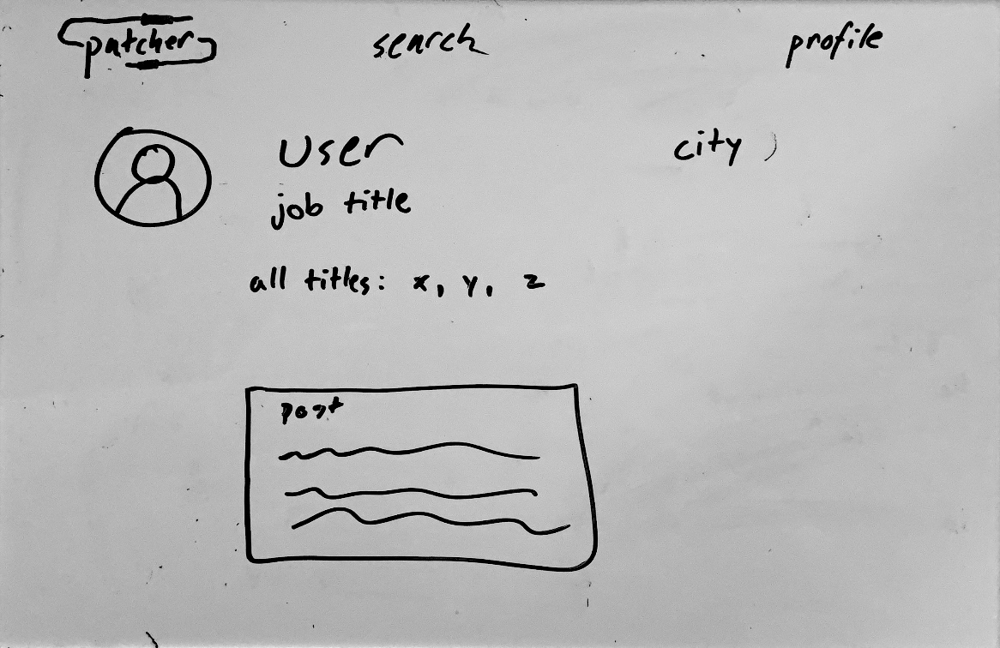
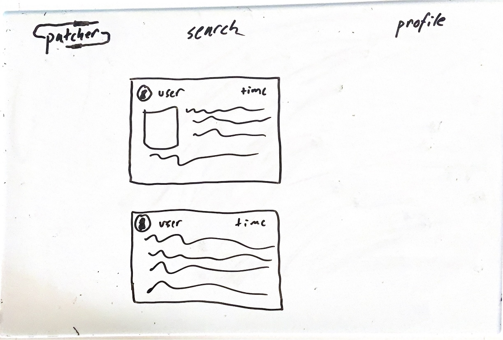
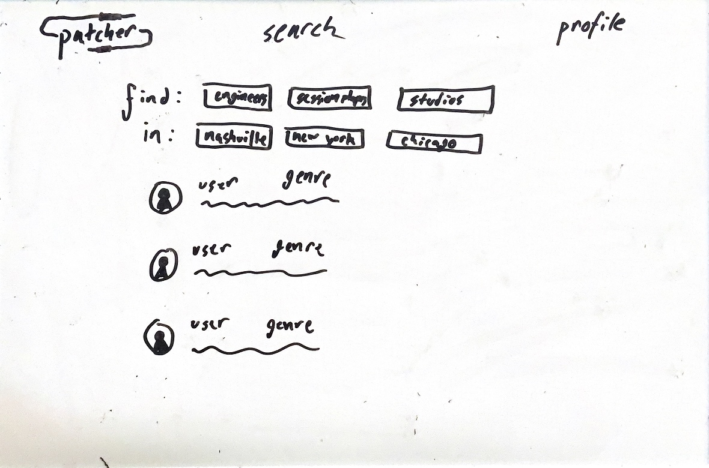
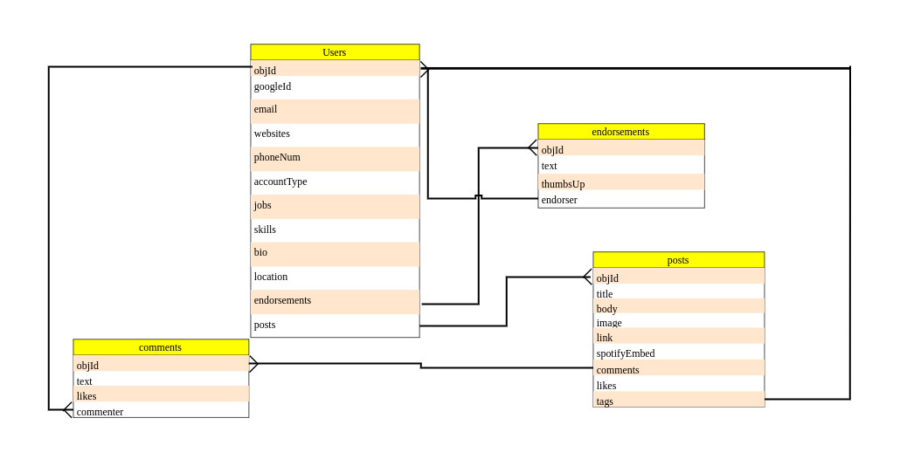

# patcher
###### by Cooper Whitley

## Intro

patcher is a professional social network aimed at the audio industry. It aims to connect all of the disparate types of professionals in the industry with each other, in order to more easily find the right team of people for every project. Its other big aim is to lower the networking barrier of entry for a field that is overwhelmingly based on word of mouth, and consolidate industry professionals' portfolios on one platform.

#### Technologies Used
- MongoDB
- Express
- EJS
- Node.js
- JavaScript
- CSS
- OAuth

#### How did we get here?

 

 
 
The audio industry has modernized in many ways, except in one of the most important. Finding work and finding the right people for the job is a process that can be excrutiating, as it is almost entirely still word of mouth based networking that forms the baseline of the industry. Aside from gear forums, there's also no good way to form an online community for this group, and the goal here is to enable all these things to be conducted in one central location. No more settling for the only session guitarist you know, no more getting skipped over because people have no way to find your work.

## User Stories

#### MVP

As a user I want to...

##### Make a profile

- register with Google via OAuth
- choose job classifications from a list:
    - live engineer
    - studio engineer
    - producer
    - songwriter
    - artist
    - composer
    - arranger
    - session musician
    - voice actor
- choose account classification from a list:
    - individual
    - recording studio
    - label
    - live production company
    - industry org (AES, IATSE, AFM, etc.)
    - client (think people looking for audio pros, like a business wanting to run an event)
- add contact information
    - email
    - personal site
    - phone number
    - linkedin/other social media
- list specific skills tied to job class
    - example: for studio engineers:
        - tracking engineer
        - overdub engineer
        - ADR engineer
        - mixing engineer
        - mastering engineer
- add a bio
- add location
- add services, which includes:
    - type of service
    - price
    - description
    - location (e.g. is this in person or remote?)
- add list of certifications

##### Make a post

- add text
- add image (optional)
- embed spotify link

##### Find a team

- view profiles by job classification
- view profiles by city
- view profiles by account classification

##### Navigate the site

- view patchbay (a timeline of posts on homepage)
- view find a team page
- view personal profile

#### Completed

#### To Do

#### Ice Box

- add portfolio section to profiles
- add complex search by multiple qualities
- add following mechanism and following patchbay
- add OAuth via LinkedIn
- add ability to endorse users
- add ability to comment on posts
- add ability to tag users in posts
- add ability to pin posts/skills/classifications to top of profile
- add dating app style interface for finding people
- expand to other parts of the entertainment industry (video, lighting, etc.)

## Diagrams

#### Wireframes

 
 

 
 

 
 

#### ERD

